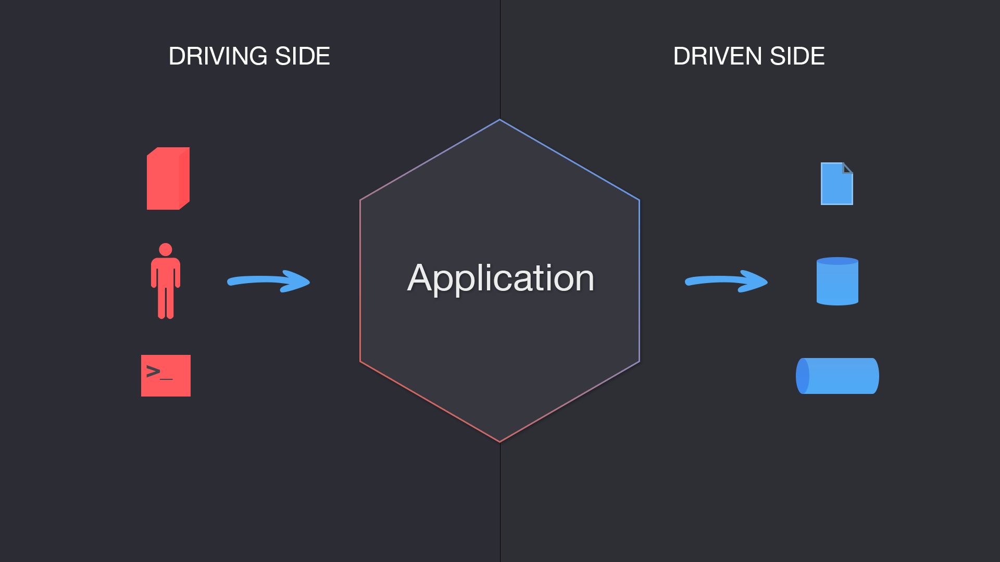

# Exchange Api Project

This project provides currency related operations such as party inquiry,convert amount and getting converted amount information.
The project is production-ready implementation of Domain Driven Design via Hexagonal Architecture (aka Ports And Adapters Pattern) written in Java.

---

## Table of Contents
* [Hexagonal Architecture Flow Diagram](#Hexagonal Architecture Flow Diagram )
* [Technologies Used](#Technologies-Used)
* [Quality Metric](#Quality Metric)
* [Authors](#Authors)

---

### Hexagonal Architecture Flow Diagram

### Technologies Used

Here is the list of technologies we used for the demo application;

* Spring Boot
* Java 11
* Git
* Maven
* Swagger
* H2Db
* Lombok
* Mapstruct
* Sonar

There are the types of tests written:

* Unit tests
* Integration tests

### Quality Metric

https://sonarcloud.io/summary/overall?id=unicode08_exchange

### Authors
* **Alper Kan**